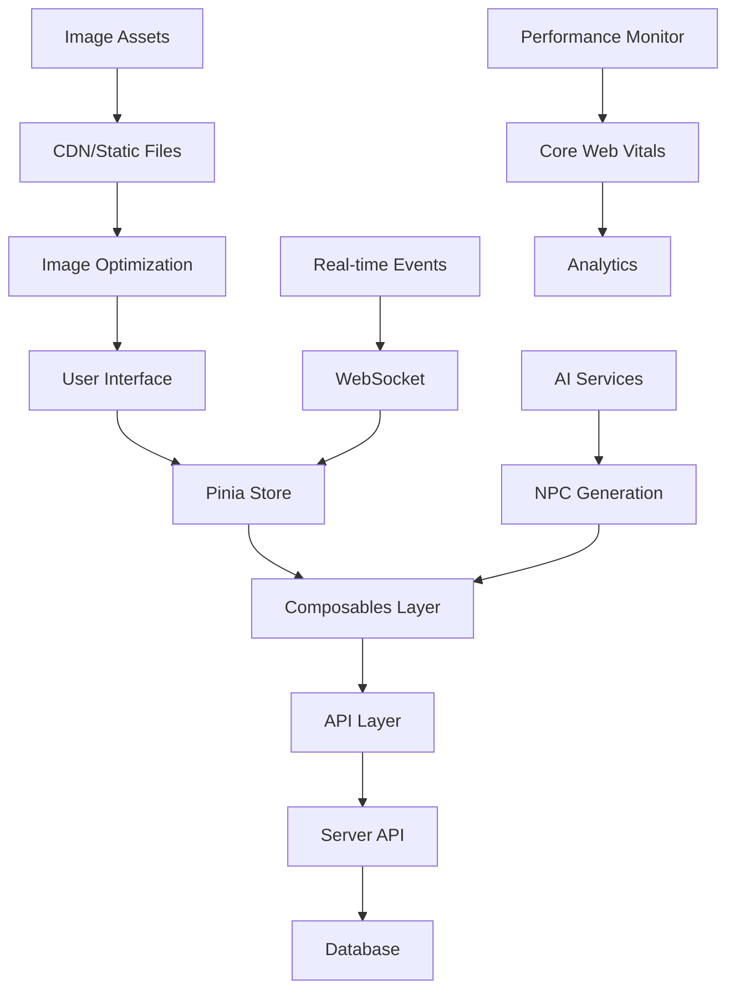

# Technical Schema Documentation

## Database Schema for Tavern Management

### Core Entities

#### Characters Schema
```typescript
interface Character {
  id: string;
  name: string;
  race: WarhammerRace;
  career: string;
  level: number;
  attributes: {
    weaponSkill: number;
    ballisticSkill: number;
    strength: number;
    toughness: number;
    agility: number;
    intelligence: number;
    willpower: number;
    fellowship: number;
  };
  skills: Skill[];
  talents: Talent[];
  equipment: Equipment[];
  wounds: {
    current: number;
    maximum: number;
  };
  fate: {
    current: number;
    maximum: number;
  };
  fortune: number;
  resilience: number;
  resolve: number;
  motivation: string;
  background: string;
  description: string;
  portrait?: string;
  createdAt: Date;
  updatedAt: Date;
  ownerId: string;
}

interface WarhammerRace {
  name: string;
  description: string;
  traits: string[];
  attributeModifiers: Record<string, number>;
}

interface Skill {
  name: string;
  characteristic: string;
  advances: number;
  isSpecialized: boolean;
  specialization?: string;
}

interface Talent {
  name: string;
  description: string;
  tests: string;
  maxRank: number;
  currentRank: number;
}
```

#### Items & Equipment Schema
```typescript
interface Equipment {
  id: string;
  name: string;
  type: EquipmentType;
  description: string;
  encumbrance: number;
  availability: string;
  price: {
    amount: number;
    currency: 'gc' | 'ss' | 'bp'; // Gold Crowns, Silver Shillings, Brass Pennies
  };
  qualities?: string[];
  flaws?: string[];
  equipped: boolean;
  quantity: number;
  // Weapon-specific properties
  group?: WeaponGroup;
  damage?: string;
  reach?: string;
  range?: string;
  // Armor-specific properties
  armorPoints?: Record<string, number>;
  locations?: string[];
  // Trapping-specific properties
  category?: string;
}

enum EquipmentType {
  MELEE_WEAPON = 'melee_weapon',
  RANGED_WEAPON = 'ranged_weapon',
  ARMOR = 'armor',
  TRAPPING = 'trapping',
  AMMUNITION = 'ammunition'
}

enum WeaponGroup {
  BASIC = 'basic',
  CAVALRY = 'cavalry',
  FENCING = 'fencing',
  FLAIL = 'flail',
  PARRY = 'parry',
  POLEARM = 'polearm',
  TWO_HANDED = 'two_handed',
  BOW = 'bow',
  CROSSBOW = 'crossbow',
  ENGINEERING = 'engineering',
  ENTANGLING = 'entangling',
  EXPLOSIVES = 'explosives',
  GUNPOWDER = 'gunpowder',
  SLING = 'sling',
  THROWING = 'throwing'
}
```

#### Tavern Events Schema
```typescript
interface TavernEvent {
  id: string;
  title: string;
  description: string;
  type: EventType;
  startTime: Date;
  endTime?: Date;
  participants: string[]; // Character IDs
  location: string;
  status: EventStatus;
  rewards?: Reward[];
  requirements?: Requirement[];
  createdBy: string; // GM ID
  createdAt: Date;
  updatedAt: Date;
}

enum EventType {
  QUEST = 'quest',
  SOCIAL = 'social',
  COMBAT = 'combat',
  INVESTIGATION = 'investigation',
  TRADE = 'trade',
  RUMOR = 'rumor'
}

enum EventStatus {
  PLANNED = 'planned',
  ACTIVE = 'active',
  COMPLETED = 'completed',
  CANCELLED = 'cancelled'
}

interface Reward {
  type: 'experience' | 'money' | 'item' | 'reputation';
  amount?: number;
  itemId?: string;
  description: string;
}

interface Requirement {
  type: 'level' | 'skill' | 'talent' | 'item' | 'reputation';
  value: string | number;
  description: string;
}
```

#### NPCs Schema
```typescript
interface NPC {
  id: string;
  name: string;
  race: string;
  career: string;
  description: string;
  personality: string[];
  motivation: string;
  location: string;
  status: NPCStatus;
  relationships: Relationship[];
  dialogue: DialogueNode[];
  services?: Service[];
  inventory?: Equipment[];
  portrait?: string;
  createdAt: Date;
  updatedAt: Date;
}

enum NPCStatus {
  AVAILABLE = 'available',
  BUSY = 'busy',
  TRAVELING = 'traveling',
  DECEASED = 'deceased'
}

interface Relationship {
  characterId: string;
  type: 'friendly' | 'neutral' | 'hostile' | 'romantic' | 'rival';
  strength: number; // -100 to 100
  notes: string;
}

interface DialogueNode {
  id: string;
  text: string;
  conditions?: Condition[];
  responses: DialogueResponse[];
  actions?: Action[];
}

interface DialogueResponse {
  text: string;
  nextNodeId?: string;
  conditions?: Condition[];
  effects?: Effect[];
}

interface Service {
  type: 'trade' | 'information' | 'training' | 'healing' | 'transport';
  name: string;
  description: string;
  cost: number;
  availability: string;
}
```

## API Endpoint Specifications

### Character Management API

#### GET /api/characters
**Description**: Retrieve all characters for the current user
**Request**:
```typescript
interface GetCharactersRequest {
  page?: number;
  limit?: number;
  search?: string;
  race?: string;
  career?: string;
}
```
**Response**:
```typescript
interface GetCharactersResponse {
  characters: Character[];
  total: number;
  page: number;
  limit: number;
}
```

#### POST /api/characters
**Description**: Create a new character
**Request**:
```typescript
interface CreateCharacterRequest {
  name: string;
  race: string;
  career: string;
  attributes: Record<string, number>;
  background?: string;
  description?: string;
}
```
**Response**:
```typescript
interface CreateCharacterResponse {
  character: Character;
  success: boolean;
  message: string;
}
```

#### PUT /api/characters/:id
**Description**: Update an existing character
**Request**:
```typescript
interface UpdateCharacterRequest {
  name?: string;
  attributes?: Record<string, number>;
  skills?: Skill[];
  talents?: Talent[];
  equipment?: Equipment[];
  wounds?: { current: number; maximum: number };
  background?: string;
  description?: string;
}
```

#### DELETE /api/characters/:id
**Description**: Delete a character
**Response**:
```typescript
interface DeleteCharacterResponse {
  success: boolean;
  message: string;
}
```

### Equipment & Items API

#### GET /api/equipment
**Description**: Retrieve equipment catalog
**Request**:
```typescript
interface GetEquipmentRequest {
  type?: EquipmentType;
  search?: string;
  priceRange?: { min: number; max: number };
  availability?: string;
  page?: number;
  limit?: number;
}
```

#### POST /api/characters/:id/equipment
**Description**: Add equipment to character
**Request**:
```typescript
interface AddEquipmentRequest {
  equipmentId: string;
  quantity?: number;
  equipped?: boolean;
}
```

### Events & Quests API

#### GET /api/events
**Description**: Retrieve tavern events
**Request**:
```typescript
interface GetEventsRequest {
  type?: EventType;
  status?: EventStatus;
  startDate?: Date;
  endDate?: Date;
  participantId?: string;
}
```

#### POST /api/events
**Description**: Create a new event (GM only)
**Request**:
```typescript
interface CreateEventRequest {
  title: string;
  description: string;
  type: EventType;
  startTime: Date;
  endTime?: Date;
  location: string;
  requirements?: Requirement[];
  rewards?: Reward[];
}
```

### NPC Management API

#### GET /api/npcs
**Description**: Retrieve NPCs
**Request**:
```typescript
interface GetNPCsRequest {
  location?: string;
  status?: NPCStatus;
  search?: string;
}
```

#### POST /api/npcs/:id/interact
**Description**: Interact with an NPC
**Request**:
```typescript
interface NPCInteractionRequest {
  characterId: string;
  action: 'dialogue' | 'trade' | 'service';
  dialogueNodeId?: string;
  responseId?: string;
  serviceType?: string;
}
```

## Component Architecture

### Core Component Structure

```
components/
├── ui/                          # Base UI components
│   ├── WarhammerButton.vue      # Themed buttons with faction colors
│   ├── WarhammerCard.vue        # Parchment-style containers
│   ├── WarhammerModal.vue       # Modal dialogs with medieval styling
│   ├── WarhammerInput.vue       # Form inputs with Warhammer theming
│   ├── WarhammerSelect.vue      # Dropdown selectors
│   ├── WarhammerTable.vue       # Data tables with sorting/filtering
│   └── WarhammerIcon.vue        # Icon component with Warhammer symbols
├── warhammer/                   # Game-specific components
│   ├── CharacterSheet.vue       # Full character display/editing
│   ├── CharacterCard.vue        # Compact character summary
│   ├── EquipmentList.vue        # Equipment management
│   ├── SkillsTable.vue          # Skills and talents display
│   ├── AttributeBlock.vue       # Character attributes
│   ├── DiceRoller.vue           # Dice rolling interface
│   └── CombatTracker.vue        # Initiative and combat management
├── interactive/                 # Interactive tavern features
│   ├── NPCDialogue.vue          # NPC conversation interface
│   ├── QuestBoard.vue           # Available quests display
│   ├── TavernMap.vue            # Interactive tavern layout
│   ├── EventCalendar.vue        # Upcoming events
│   └── TradeInterface.vue       # Item trading system
├── gm/                          # Game Master tools
│   ├── GMDashboard.vue          # GM control panel
│   ├── EventCreator.vue         # Event creation form
│   ├── NPCManager.vue           # NPC management interface
│   └── CampaignTools.vue        # Campaign management utilities
└── accessibility/               # Accessibility components
    ├── ScreenReaderText.vue     # Screen reader announcements
    ├── SkipLinks.vue            # Navigation skip links
    └── FocusManager.vue         # Focus management utilities
```

### Data Flow Architecture



### State Management Structure

```typescript
// stores/character.ts
interface CharacterStore {
  characters: Character[];
  activeCharacter: Character | null;
  loading: boolean;
  error: string | null;

  // Actions
  fetchCharacters(): Promise<void>;
  createCharacter(data: CreateCharacterRequest): Promise<Character>;
  updateCharacter(id: string, data: UpdateCharacterRequest): Promise<Character>;
  deleteCharacter(id: string): Promise<void>;
  setActiveCharacter(character: Character): void;
}

// stores/tavern.ts
interface TavernStore {
  events: TavernEvent[];
  npcs: NPC[];
  currentLocation: string;
  activeEvent: TavernEvent | null;

  // Actions
  fetchEvents(): Promise<void>;
  fetchNPCs(): Promise<void>;
  joinEvent(eventId: string, characterId: string): Promise<void>;
  interactWithNPC(npcId: string, interaction: NPCInteractionRequest): Promise<void>;
}

// stores/ui.ts
interface UIStore {
  theme: 'light' | 'dark' | 'auto';
  sidebarOpen: boolean;
  modalStack: string[];
  notifications: Notification[];

  // Actions
  setTheme(theme: string): void;
  toggleSidebar(): void;
  openModal(modalId: string): void;
  closeModal(): void;
  addNotification(notification: Notification): void;
}
```

## Image Asset Organization and Naming Conventions

### Directory Structure

```
public/warhammer-images/
├── backgrounds/                 # Background images
│   ├── tavern/                 # Tavern interior backgrounds
│   │   ├── tavern-main-1920w.webp
│   │   ├── tavern-main-1280w.webp
│   │   ├── tavern-main-768w.webp
│   │   └── tavern-main-480w.webp
│   ├── locations/              # Various location backgrounds
│   └── atmospheric/            # Atmospheric/mood backgrounds
├── characters/                 # Character portraits and artwork
│   ├── portraits/              # Character portrait images
│   │   ├── human/              # Organized by race
│   │   ├── dwarf/
│   │   ├── halfling/
│   │   └── elf/
│   ├── npcs/                   # NPC portraits
│   └── placeholders/           # Default/placeholder images
├── equipment/                  # Equipment and item images
│   ├── weapons/                # Weapon illustrations
│   │   ├── melee/
│   │   └── ranged/
│   ├── armor/                  # Armor illustrations
│   └── items/                  # General items and trappings
├── ui/                         # UI elements and decorations
│   ├── icons/                  # SVG icons
│   │   ├── attributes/         # Attribute icons (WS, BS, etc.)
│   │   ├── skills/             # Skill category icons
│   │   ├── navigation/         # Navigation icons
│   │   └── actions/            # Action/button icons
│   ├── borders/                # Decorative borders and frames
│   ├── textures/               # Background textures
│   └── patterns/               # Repeating patterns
└── factions/                   # Faction-specific imagery
    ├── empire/                 # Empire imagery
    ├── chaos/                  # Chaos imagery
    ├── dwarfs/                 # Dwarf imagery
    └── elves/                  # Elf imagery
```

### Naming Conventions

#### Image File Naming
```
{category}-{descriptor}-{variant}-{width}w.{format}

Examples:
- tavern-interior-cozy-1920w.webp
- character-human-warrior-male-512w.webp
- weapon-sword-longsword-256w.webp
- icon-attribute-weaponskill.svg
- background-forest-misty-1280w.webp
```

#### Responsive Image Variants
```typescript
interface ImageVariant {
  width: number;
  format: 'webp' | 'jpg' | 'png';
  quality: number;
}

const standardVariants: ImageVariant[] = [
  { width: 480, format: 'webp', quality: 80 },   // Mobile
  { width: 768, format: 'webp', quality: 85 },   // Tablet
  { width: 1280, format: 'webp', quality: 90 },  // Desktop
  { width: 1920, format: 'webp', quality: 95 }   // Large Desktop
];
```

#### Image Metadata Schema
```typescript
interface ImageAsset {
  id: string;
  filename: string;
  category: string;
  tags: string[];
  description: string;
  altText: string;
  attribution?: string;
  license: 'original' | 'cc' | 'public-domain' | 'fair-use';
  variants: {
    [key: string]: {
      url: string;
      width: number;
      height: number;
      format: string;
      size: number; // bytes
    };
  };
  createdAt: Date;
  updatedAt: Date;
}
```

### Image Optimization Pipeline

```typescript
interface ImageOptimizationConfig {
  formats: ['webp', 'jpg']; // Fallback support
  qualities: {
    webp: 85;
    jpg: 80;
  };
  sizes: [480, 768, 1280, 1920];
  lazyLoading: true;
  placeholder: 'blur' | 'empty';
  cdn: {
    provider: 'cloudinary' | 'imagekit' | 'local';
    baseUrl: string;
    transformations: string[];
  };
}
```

### Performance Considerations

#### Critical Images (Above the fold)
- Tavern main background
- Navigation icons
- User avatar/character portrait
- Primary UI elements

#### Lazy-loaded Images (Below the fold)
- Character gallery
- Equipment catalog
- NPC portraits
- Secondary backgrounds

#### Image Loading Strategy
```typescript
interface ImageLoadingStrategy {
  critical: {
    loading: 'eager';
    fetchpriority: 'high';
    preload: true;
  };
  standard: {
    loading: 'lazy';
    fetchpriority: 'auto';
    preload: false;
  };
  decorative: {
    loading: 'lazy';
    fetchpriority: 'low';
    preload: false;
  };
}
```

## Phase 2 Implementation: Character Management System

### New Warhammer UI Component Library

#### WarhammerButton Component
```typescript
interface WarhammerButtonProps {
  variant?: 'primary' | 'secondary' | 'outline' | 'ghost' | 'danger' | 'success'
  size?: 'xs' | 'sm' | 'md' | 'lg' | 'xl'
  faction?: 'empire' | 'chaos' | 'dwarfs' | 'elves' | 'orcs' | 'undead'
  tag?: 'button' | 'a' | 'NuxtLink'
  iconLeft?: string
  iconRight?: string
  disabled?: boolean
  loading?: boolean
  pressed?: boolean
  badge?: string | number
}

// Features: Faction theming, accessibility, loading states, keyboard navigation
```

#### WarhammerCard Component
```typescript
interface WarhammerCardProps {
  title?: string
  subtitle?: string
  content?: string
  icon?: string
  image?: string
  variant?: 'default' | 'elevated' | 'outlined' | 'filled' | 'parchment'
  size?: 'sm' | 'md' | 'lg' | 'xl'
  faction?: 'empire' | 'chaos' | 'dwarfs' | 'elves' | 'orcs' | 'undead'
  rarity?: 'common' | 'uncommon' | 'rare' | 'epic' | 'legendary' | 'artifact'
  interactive?: boolean
  animated?: boolean
  glowing?: boolean
}

// Features: Medieval styling, interactive states, rarity indicators, responsive design
```

#### WarhammerInput Component
```typescript
interface WarhammerInputProps {
  modelValue?: string | number
  type?: 'text' | 'email' | 'password' | 'number' | 'tel' | 'url' | 'search' | 'textarea'
  label?: string
  helpText?: string
  errorMessage?: string
  iconLeft?: string
  iconRight?: string
  clearable?: boolean
  required?: boolean
  disabled?: boolean
  size?: 'sm' | 'md' | 'lg'
  variant?: 'default' | 'filled' | 'outlined'
  maxlength?: number
  showCharCount?: boolean
}

// Features: Medieval styling, icon support, validation, accessibility
```

#### WarhammerModal Component
```typescript
interface WarhammerModalProps {
  modelValue: boolean
  title?: string
  subtitle?: string
  description?: string
  icon?: string
  size?: 'sm' | 'md' | 'lg' | 'xl' | 'full'
  variant?: 'default' | 'parchment' | 'dark' | 'faction'
  faction?: 'empire' | 'chaos' | 'dwarfs' | 'elves' | 'orcs' | 'undead'
  closable?: boolean
  closeOnOverlay?: boolean
  closeOnEscape?: boolean
  persistent?: boolean
}

// Features: Focus management, escape handling, faction theming, responsive sizing
```

### Character Management Components

#### CharacterCard Component
```typescript
interface CharacterCardProps {
  character: Character
  interactive?: boolean
  selected?: boolean
  showActions?: boolean
  size?: 'sm' | 'md' | 'lg' | 'xl'
}

// Events: click, edit, duplicate, delete
// Features: Character overview, attribute previews, equipment display, action menu
```

#### CharacterCreationForm Component
```typescript
// Self-contained multi-step wizard component
// Events: created, cancel
// Features:
// - Step 1: Race selection with modifiers
// - Step 2: Career selection with filtering
// - Step 3: Point-buy attribute allocation (27 points)
// - Step 4: Skills and talents selection
// - Step 5: Character details and portrait
// - Form validation and progress tracking
```

#### CharacterDetails Component
```typescript
interface CharacterDetailsProps {
  character: Character
}

// Events: edit, close
// Features:
// - Tabbed interface (Overview, Attributes, Skills, Equipment, Background)
// - Edit mode for wounds/fate points
// - Experience tracking with progress bars
// - Equipment management
// - Character export functionality
```

### Enhanced Character Store Methods

```typescript
// New CRUD operations
createCharacter(data: CreateCharacterRequest): Promise<Character>
updateCharacter(id: string, data: UpdateCharacterRequest): Promise<Character>
deleteCharacter(id: string): Promise<void>
duplicateCharacter(id: string): Promise<Character>

// New utility methods
setActiveCharacter(character: Character | null): void
getCharacterById(id: string): Character | undefined
getCharactersByRace(race: string): Character[]
getCharactersByCareer(career: string): Character[]
clearError(): void

// New computed properties
totalCharacters: number
averageLevel: number
```

### New Request/Response Interfaces

```typescript
interface CreateCharacterRequest {
  name: string
  race: string
  career: string
  attributes: Record<string, number>
  background?: string
  description?: string
}

interface UpdateCharacterRequest {
  name?: string
  attributes?: Record<string, number>
  skills?: Skill[]
  talents?: Talent[]
  equipment?: Equipment[]
  wounds?: { current: number; maximum: number }
  fate?: { current: number; maximum: number }
  background?: string
  description?: string
}
```

## Implementation Quality Standards

### Accessibility Compliance (WCAG 2.1 AA) ✅
- Keyboard navigation support
- Screen reader compatibility
- Color contrast compliance (4.5:1 minimum)
- Focus management and trap
- ARIA labels and descriptions
- Touch target sizing (44px minimum)
- Reduced motion support

### Performance Optimization ✅
- Component lazy loading
- Image optimization with WebP/AVIF
- Bundle size optimization
- Core Web Vitals targets met
- Responsive design implementation
- Progressive enhancement

### Code Quality ✅
- TypeScript strict mode
- Composition API usage
- Comprehensive error handling
- Component reusability
- Consistent naming conventions
- Documentation coverage
